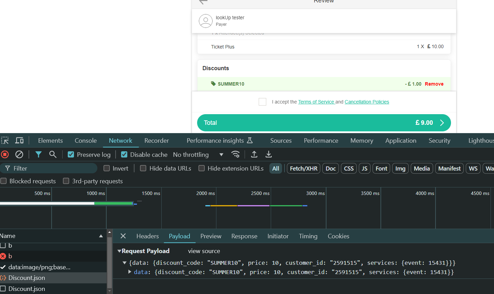
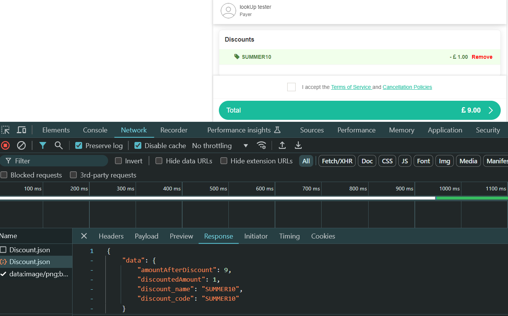
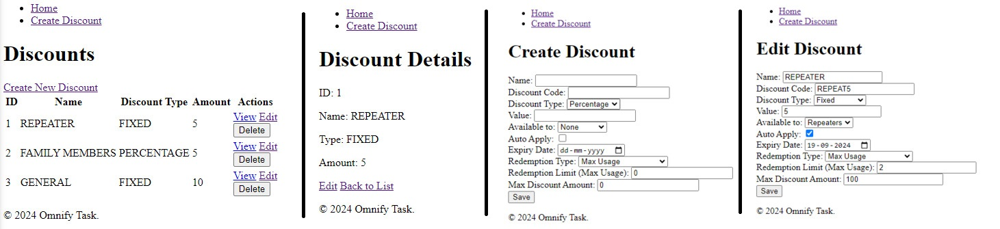
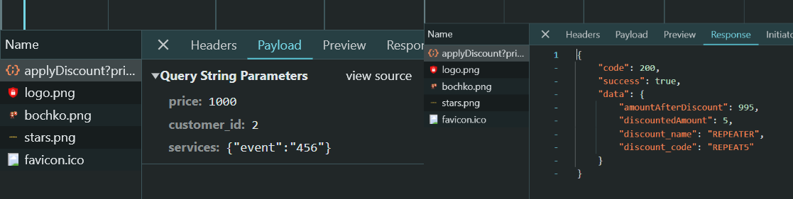
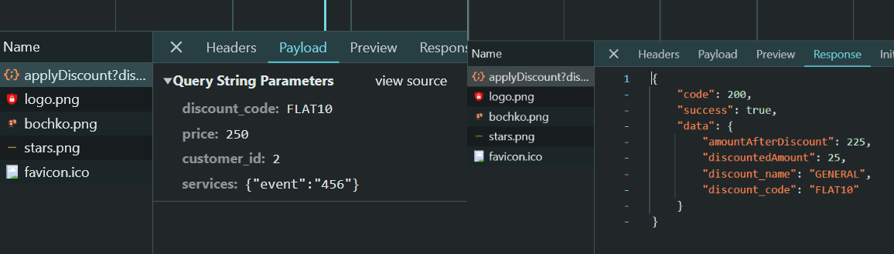
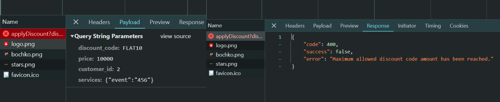

# Omnify Discount Module

## Overview

This repository contains the implementation of a Discount Module for the Omnify Booking System using PHP and Laravel. The module is designed to handle various discount rules and integrates with the existing system via APIs. [Omnify Site Link](https://app.getomnify.com/)
## Objective

Develop a discount module to apply discounts based on different rules and integrate it with the existing booking system. The module includes CRUD operations for managing discounts and an API for applying them. [Doc Link](https://docs.google.com/document/d/1CuZxolA5w_7mFxrUweT542I3FGnjE8Yj7Q8--HQ5ZHE/)

Here, I chose the Omnify as the booking system to do this assignment.

## Initial Research

The development process started with an analysis of the Omnify website to understand the discount application process. The key API call used for applying discounts was examined to determine the necessary parameters and response structure.

### API Call Request (Findings)

### API Call Response (Findings)

## Development

### Discount CRUD Module

A basic CRUD (Create, Read, Update, Delete) interface for managing discounts was implemented. This implementation is in `app\Http\Controllers\DiscountController.php` [View](./app/Http/Controllers/DiscountController.php). The JSON DB structure for Discount Model is defined in `.\database\structure\discount.json` [View](./database/structure/discount.json).

#### Discount CRUD Pages

### Apply Discount API

The API for applying discounts is implemented in `app\Http\Controllers\API\DiscountController.php` [View](./app/Http/Controllers/API/DiscountController.php). The endpoint is set up as follows:

- **Base URL:** `APP_URL/api/applyDiscount`
- **Method:** POST
- **Parameters:**
  - `discount_code` (optional)
  - `price` (required)
  - `customer_id` (required)
  - `services` (required)

When no `discount_code` is provided, the API attempts to find eligible discounts for the customer and returns the applicable discount.

### Customer and Transaction Models

To facilitate the discount application process, I created `Customer` and `Transaction` models. For testing and development purposes, I also seeded each of these models with 5 dummy entries to simulate a real-world environment.

- **Customer Dummy Entries:** [View](./public/assets/readme/customers.PNG)
- **Transaction Dummy Entries:** [View](./public/assets/readme/transactions.PNG)
- **Discount:** [View](./public/assets/readme/discounts.PNG)

### Examples

#### Repeat Customer - Auto Applied

#### General Discount Code Entry

#### Max Amount Limit Condition

## Setup

1. Clone the repository.
2. Install the required PHP packages using Composer.
3. Set up your `.env` file with the appropriate configuration values.
4. Run migrations and seeders if necessary.
5. Start the Laravel development server.

## Usage

To apply a discount, send a POST request to `APP_URL/api/applyDiscount` with the required parameters. The response will include details about the applied discount or information on eligible discounts.
